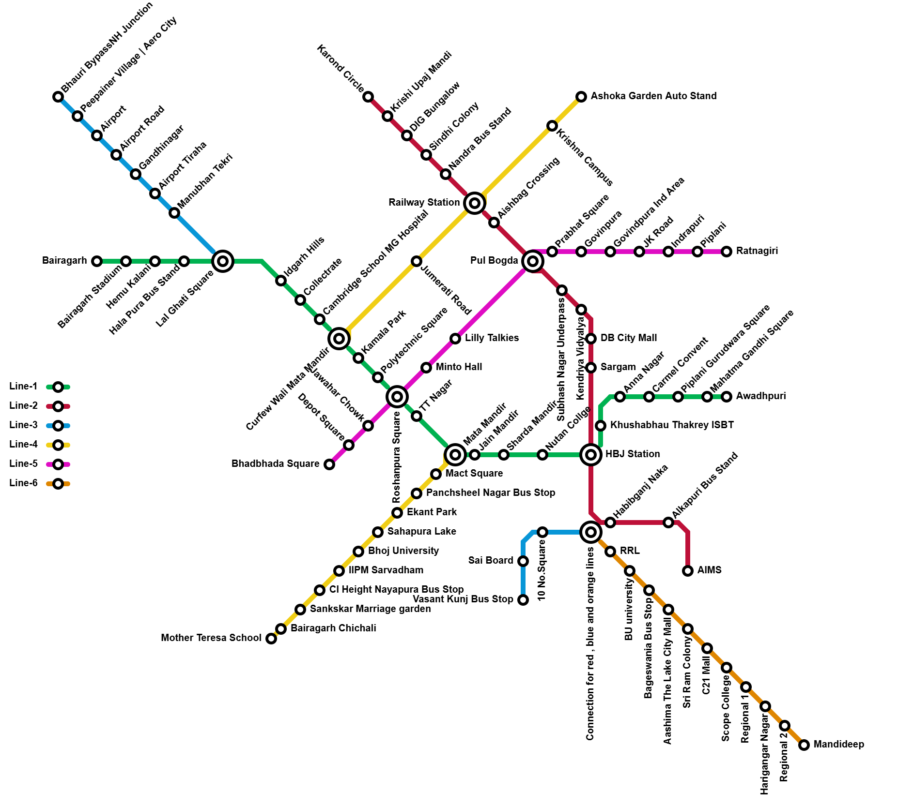

# Metro Routing and Scheduling System

## Overview
This project aims to enhance metro transportation efficiency by integrating advanced pathfinding algorithms with a scheduling system. It optimizes commuter travel routes and minimizes waiting times at stations, leading to improved operational efficiency and reduced travel time.

## Features
- **Shortest Path Finder:** Uses Dijkstra's Algorithm to compute the shortest paths from a source station to all other stations.
- **Targeted Route Finder:** Implements A* Algorithm for finding the shortest path between a specific source and destination.
- **Line Change Optimization:** Identifies optimal interchange stations for seamless multi-line journeys.
- **Travel Time & Distance Calculation:** Computes estimated travel time and distance.
- **Efficient Scheduler:** Generates metro train arrival and departure schedules to avoid congestion and ensure smooth operations.

## Technologies Used
- **Algorithms:** Dijkstra's Algorithm, A* Algorithm
- **Programming Language:** C++
- **Scheduling Techniques:** Constraint Programming
- **Graph Processing:** Metro network representation using nodes and edges

## System Architecture


1. **Pathfinding Module:**
   - Accepts user input for source and destination.
   - Uses Dijkstra’s Algorithm for shortest path calculation.
   - Uses A* Algorithm for targeted pathfinding based on heuristic evaluation.
   
2. **Scheduling Module:**
   - Generates a timetable considering train frequency and station interconnections.
   - Computes travel time using predefined parameters such as buffer time and speed constraints.
   
3. **Navigation System:**
   - Provides route details, estimated travel time, and required line changes.
   - Displays station connectivity and optimal routes.

## How to Run the Project
```bash
# Clone the repository
git clone <repository_url>

# Navigate to the project directory
cd <project_directory>

# Compile the C++ program
g++ -o metro_scheduler metro_scheduler.cpp

# Run the program
./metro_scheduler
```

## Future Enhancements
- **Real-time Train Tracking:** Incorporate live updates to dynamically adjust scheduling.
- **Adaptive Scheduling:** Adjust train frequency based on real-time commuter demand.
- **Integration with Other Transport Systems:** Provide multi-modal transport options for seamless urban mobility.

## Authors
- **Balkishan Bajpay** - IIIT Manipur
- **Moirangthem Dennis Singh** - IIIT Manipur

For any inquiries, contact: [bkbajpay0905@gmail.com](mailto:bkbajpay0905@gmail.com)

## License
This project is licensed under the IEEE Conference Publications framework.

